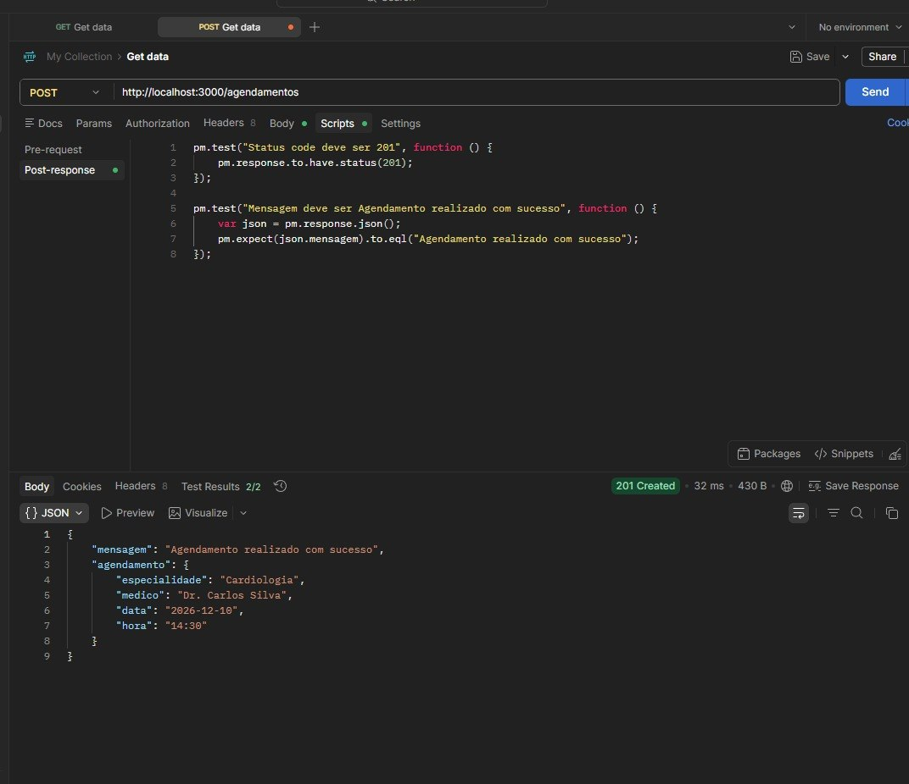
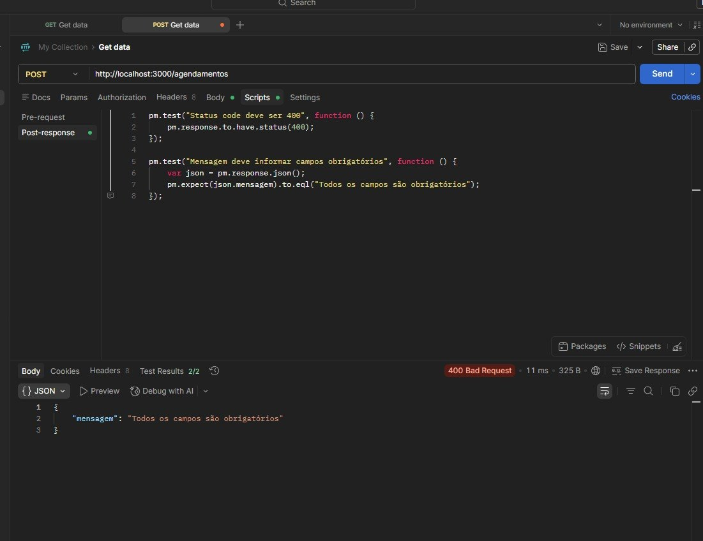
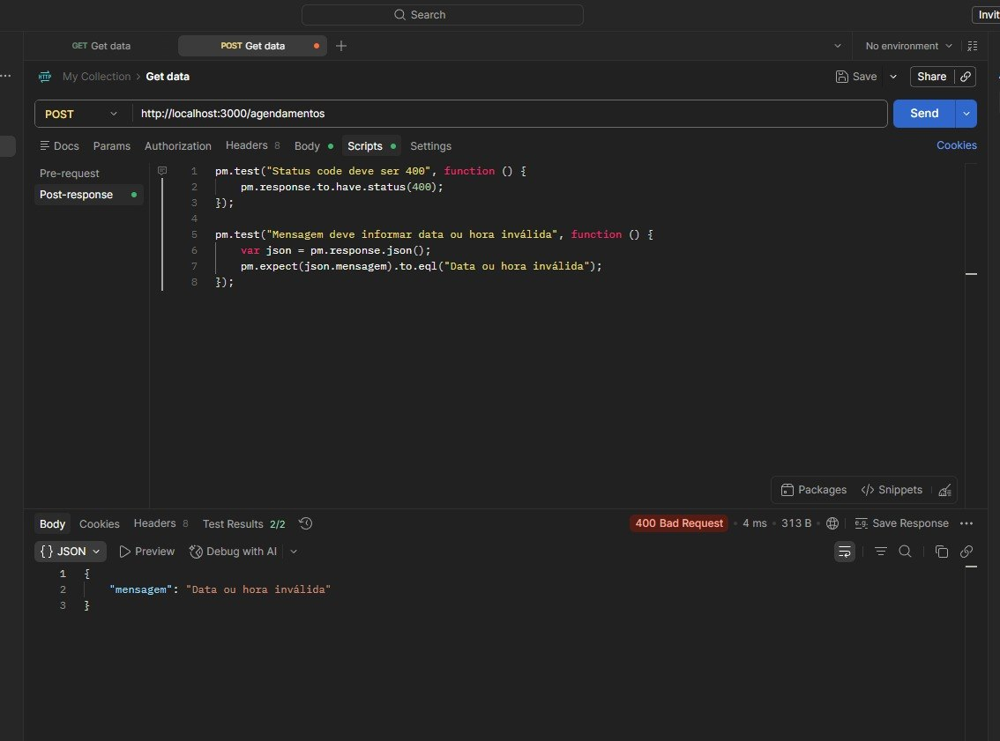
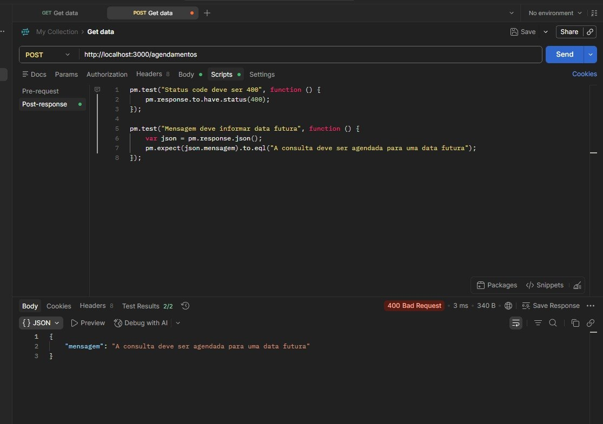

# Relatório de Execução — API de Agendamentos

## Endpoint testado

`POST /agendamentos`

## Ambiente de testes

| Item | Valor |
|---|---|
| Ferramenta | Postman |
| Ambiente | Local |
| Base URL | http://localhost:3000 |
| Data de execução | 31/05/2026 |

## Resultados

| Caso de Teste | Resultado Esperado | Resultado Obtido | Status |
|---|---|---|---|
| CT01 — Agendamento válido | 201 — Agendamento realizado com sucesso | 201 — Agendamento realizado com sucesso | Aprovado |
| CT02 — Campo obrigatório ausente | 400 — Todos os campos são obrigatórios | 400 — Todos os campos são obrigatórios | Aprovado |
| CT03 — Data inválida | 400 — Data ou hora inválida | 400 — Data ou hora inválida | Aprovado |
| CT04 — Data no passado | 400 — A consulta deve ser agendada para uma data futura | 400 — A consulta deve ser agendada para uma data futura | Aprovado |

## Evidências

### CT01 — Agendamento válido

### CT02 — Campo obrigatório ausente

### CT03 — Data inválida

### CT04 — Data no passado

## Resumo dos resultados

| Total de testes | Aprovados | Reprovados |
|---|---|---|
| 4 | 4 | 0 |

## Conclusão

Os testes executados no endpoint de agendamentos apresentaram conformidade com o comportamento esperado. O endpoint validou corretamente os campos obrigatórios, datas inválidas, datas passadas e o cenário de agendamento válido.
