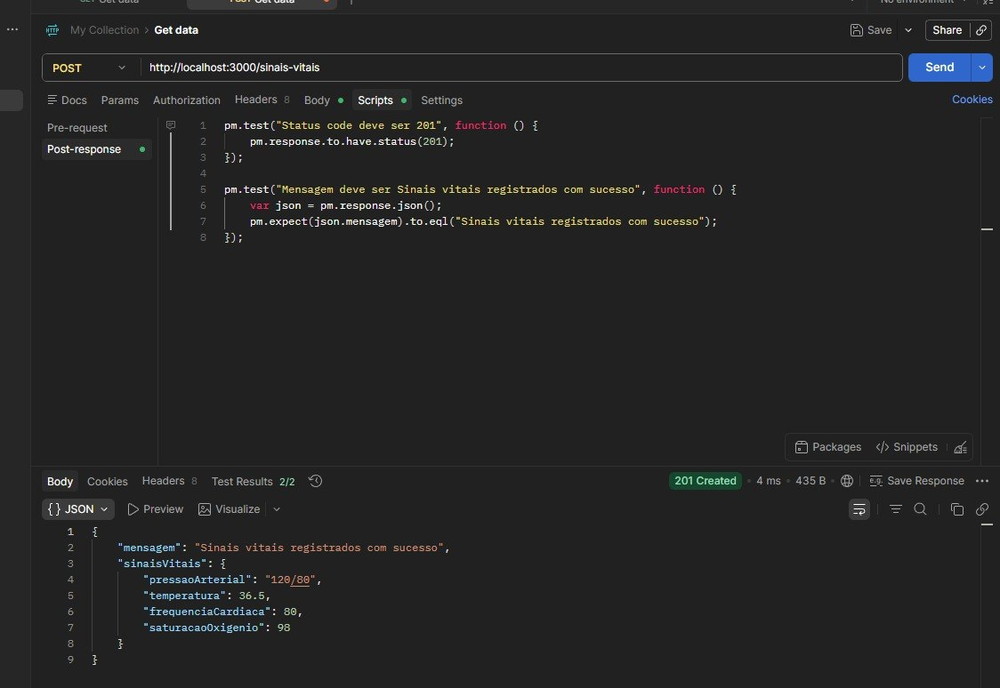
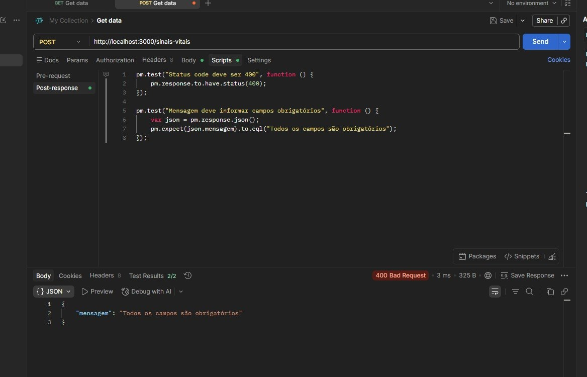
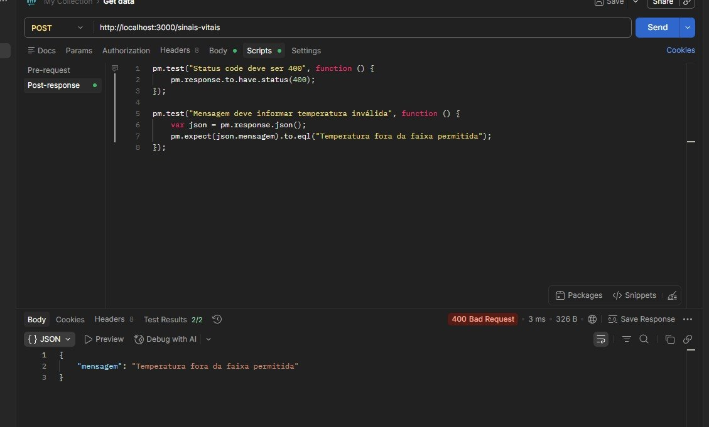
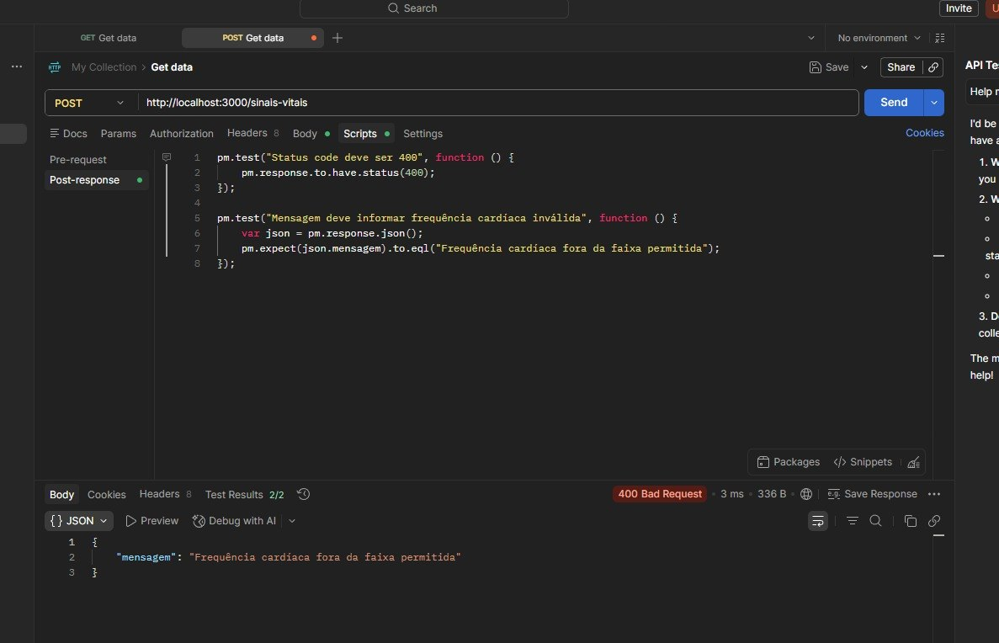
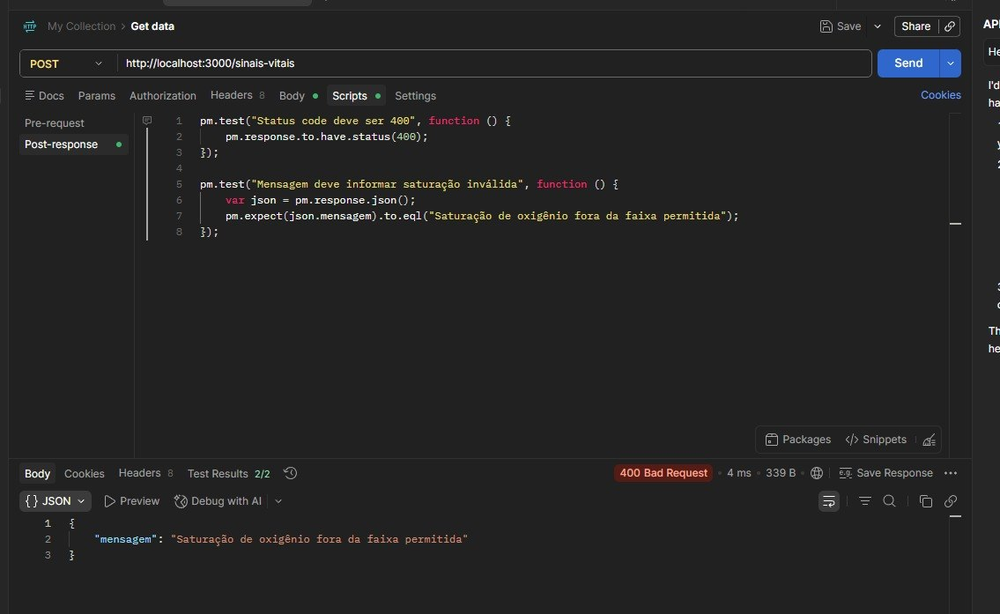

# Relatório de Execução — API de Sinais Vitais

## Endpoint testado

`POST /sinais-vitais`

## Ambiente de testes

| Item | Valor |
|---|---|
| Ferramenta | Postman |
| Ambiente | Local |
| Base URL | http://localhost:3000 |
| Data de execução | 31/05/2026 |

## Resultados

| Caso de Teste | Resultado Esperado | Resultado Obtido | Status |
|---|---|---|---|
| CT01 — Dados válidos | 201 — Sinais vitais registrados com sucesso | 201 — Sinais vitais registrados com sucesso | Aprovado |
| CT02 — Campo obrigatório ausente | 400 — Todos os campos são obrigatórios | 400 — Todos os campos são obrigatórios | Aprovado |
| CT03 — Temperatura inválida | 400 — Temperatura fora da faixa permitida | 400 — Temperatura fora da faixa permitida | Aprovado |
| CT04 — Frequência cardíaca inválida | 400 — Frequência cardíaca fora da faixa permitida | 400 — Frequência cardíaca fora da faixa permitida | Aprovado |
| CT05 — Saturação inválida | 400 — Saturação de oxigênio fora da faixa permitida | 400 — Saturação de oxigênio fora da faixa permitida | Aprovado |

## Evidências

### CT01 — Dados válidos

### CT02 — Campo obrigatório ausente

### CT03 — Temperatura inválida

### CT04 — Frequência cardíaca inválida

### CT05 — Saturação inválida

## Resumo dos resultados

| Total de testes | Aprovados | Reprovados |
|---|---|---|
| 5 | 5 | 0 |

## Conclusão

Os testes executados no endpoint de sinais vitais apresentaram conformidade com o comportamento esperado. O endpoint validou corretamente os campos obrigatórios, os limites de temperatura, frequência cardíaca, saturação de oxigênio e o registro válido.
